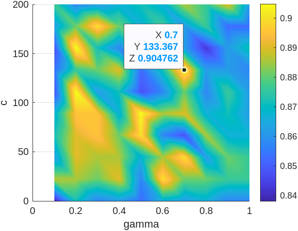

# Part 1

## Zad 1
* Accuracy train: 100.000000
* Accuracy test: 87.777778

Skuteczność na zbiorze treningowym może wskazywać na wystąpienie overfittingu.

## Zad 2
Funkcja kosztu maleje wraz ze wzrostem liczby cech, aż do momentu, gdy liczba cech wynosi 14. Następnie koszt dla zbioru walidacyjnego znacząco rośnie, podczas gdy dla zbioru treningowego nadal maleje.

Jest to zgodne z przewidywaniami – dalsze zwiększanie liczby cech powyżej 14 powoduje, że model zaczyna zapamiętywać konkretne przykłady ze zbioru treningowego zamiast uczyć się ogólnych cech charakterystycznych dla danej klasy obiektów.

Na wykresie skuteczności również widać jej spadek przy liczbie cech większej niż 15.

Z tego powodu liczba cech równa 14 wydaje się optymalnym wyborem.

## Zad 3

Zwiększenie rozmiaru zbioru wykazuje tendencję wzrostową skuteczności oraz spadkową dla kosztu.
Jednak ze względu na duże wahania skuteczności na zbiorze treningowym może to sugerować, że wcześniejsze dostrojenie modelu doprowadziło do overfittingu.

## Zad 4

Ponownie można zauważyć tendencję do overfittingu. Do pewnego momentu model skutecznie się uczy, jednak po określonej liczbie iteracji koszt dla zbioru walidacyjnego zaczyna rosnąć.

Sugeruje to, że model zaczyna zapamiętywać konkretne obrazy w zbiorze treningowym zamiast uczyć się ogólnych cech pozwalających na poprawną klasyfikację obiektów.

Na podstawie wykresów wybrano wartość `iter_sel = 20`. Przy tej wartości model osiąga niski koszt dla zbioru testowego, choć nie najniższy, ponieważ dalsze zwiększanie maksymalnej liczby iteracji wciąż zmniejsza błąd na zbiorze testowym.

## Zad 5
* λ = 0.0138
* Skutecznosc 89.05

Siatka była kilkukrotnie zagęszczana w zakresie obejmującym maksimum skuteczności dla zbioru walidacyjnego.
Po trzech iteracjach znaleziono punkt λ = 0.0138, dla którego skuteczność wyniosła 89,52%.

## Zad 6
* Accuracy train: 93.333333
* Accuracy test: 87.777778

Wynik jest identyczny do tego uzyskanego w zadaniu 1. Oznacza to, że regularyzacja nie poprawiła wyników, co sugeruje, że model nie był przeuczony, a zatem zastosowanie regularyzacji nie miało wpływu na jego działanie.

# Część 2

## Zadanie 2.1
Do wyboru wartości k dla k-cross-validation przetestowano zachowanie algorytmu dla różnych wartości k w zakresie <2, 20>. Na podstawie uzyskanego wykresu, wartość k = 7 zapewniała najwyższą skuteczność.

## Zadanie 2.2
[Code](scripts/Zad2.mlx)

## Zadanie 2.3
Znalezione najlepsze parametry:
* 0.7 gamma
* 133.367 c

Dla wskazanych parametrów skuteczność wynosiła 90.5%.

| C \ Gamma | 0.1   | 0.2   | 0.3   | 0.4   | 0.5   | 0.6   | 0.7   | 0.8   | 0.9   | 1.0   |
|--------|-------|-------|-------|-------|-------|-------|-------|-------|-------|-------|
| 0.1000  | 0.8238 | 0.8714 | 0.8524 | 0.8619 | 0.8524 | 0.8619 | 0.8667 | 0.8667 | 0.8619 | 0.8571 |
| 22.3111 | 0.8714 | 0.9000 | 0.8857 | 0.8905 | 0.8619 | 0.8571 | 0.8857 | 0.8905 | 0.8952 | 0.8857 |
| 44.5222 | 0.8476 | 0.8905 | 0.8667 | 0.8810 | 0.8667 | 0.8619 | 0.8714 | 0.8762 | 0.8714 | 0.8810 |
| 66.7333 | 0.8476 | 0.9048 | 0.8667 | 0.8905 | 0.8667 | 0.8524 | 0.8571 | 0.8429 | 0.8905 | 0.8476 |
| 88.9444 | 0.8667 | 0.8952 | 0.8667 | 0.8857 | 0.8905 | 0.8619 | 0.8476 | 0.8810 | 0.8714 | 0.8476 |
| 111.1556 | 0.8714 | 0.8714 | 0.8619 | 0.8571 | 0.8667 | 0.8571 | 0.8286 | 0.8810 | 0.8667 | 0.8762 |
| 133.3667 | 0.8619 | 0.8905 | 0.8762 | 0.8810 | 0.8476 | 0.8762 | 0.8905 | 0.8762 | 0.8476 | 0.8810 |
| 155.5778 | 0.8524 | 0.8952 | 0.8762 | 0.8857 | 0.8667 | 0.8714 | 0.8714 | 0.8667 | 0.8476 | 0.8476 |
| 177.7889 | 0.8381 | 0.8714 | 0.8857 | 0.8762 | 0.8905 | 0.8667 | 0.8524 | 0.8619 | 0.8667 | 0.8524 |
| 200.0000 | 0.8619 | 0.8571 | 0.8857 | 0.8714 | 0.8429 | 0.8857 | 0.8714 | 0.8619 | 0.8619 | 0.8667 |

## Zadanie 3
Najlepsze parametry zostały znalezione przy użyciu narzędzi do przeszukiwania przestrzeni parametrów:
* c = 144.7625
* gamma = 0.1362
* cv_accuracy = 0.9095
